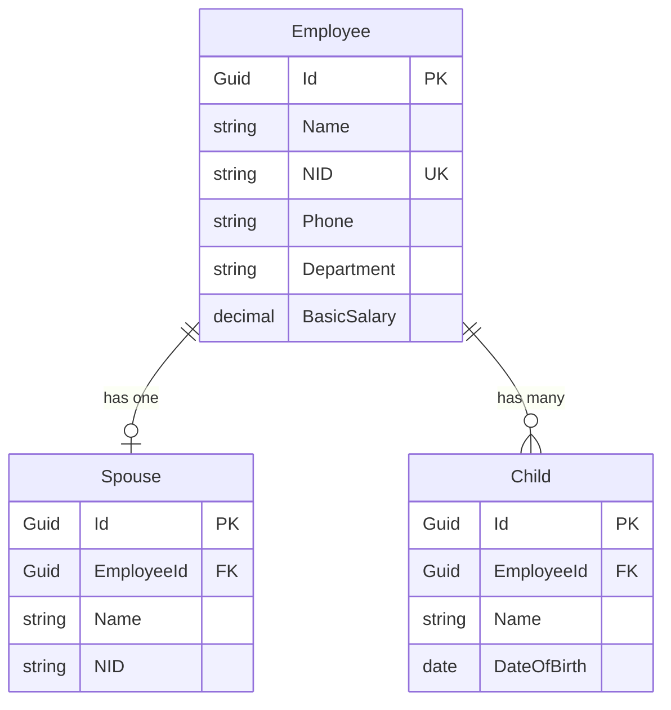

<div align="center">
  <h1>👨‍💼 Employee & Family Registry System</h1>
  <p>
    <strong>A full‑stack solution for managing employee records and family details, built for the Bangladeshi context.</strong>
  </p>
  <p>
    
    
    
    
    
    
  </p>
  <p>
    <a href="#features">Features</a> •
    <a href="#tech-stack">Tech Stack</a> •
    <a href="#architecture">Architecture</a> •
    <a href="#api-endpoints">API</a> •
    <a href="#setup">Setup</a> •
    <a href="#srs">SRS</a>
  </p>
</div>

---

## ✨ Features

| Area              | Details                                                                 |
|-------------------|-------------------------------------------------------------------------|
| **Employee CRUD** | Create, delete, and search employees by name, NID, or department.      |
| **Family Ties**   | One-to-one spouse + one-to-many children per employee.                 |
| **Validation**    | NID (10/17 digits), Bangladeshi phone (+8801/01), positive salary.     |
| **PDF Reports**   | Individual employee profile & full employee list (with filtering).     |
| **Role‑based Auth**| `Viewer` (read‑only) / `Admin` (full control) via `X-User-Role` header.|
| **Debounced Search**| Smooth, optimised API calls on every keystroke.                      |

---

## 🛠️ Tech Stack

### Backend
- **Framework**: ASP.NET Core 8 Web API
- **Architecture**: Clean Architecture (Domain, Application, Infrastructure, API)
- **ORM**: Entity Framework Core
- **Database**: PostgreSQL
- **Validation**: FluentValidation
- **PDF Generation**: QuestPDF

### Frontend
- **Framework**: React 18
- **Build Tool**: Vite
- **Styling**: TailwindCSS
- **HTTP Client**: Axios
- **Language**: JavaScript (`.jsx`)

---

## 🏛️ Architecture

The solution follows **Clean Architecture** principles for separation of concerns and maintainability.

```plaintext
EmployeeRegistry/
│
├── EmployeeRegistry.Domain        # Core entities (Employee, Spouse, Child)
├── EmployeeRegistry.Application    # DTOs, Commands, Validators, Interfaces
├── EmployeeRegistry.Infrastructure # EF Core, Repositories, PDF Service, Seeder
└── EmployeeRegistry.API            # Controllers, Middleware, Program.cs
```

· Domain – enterprise‑wide business rules.
· Application – use cases and application‑specific logic.
· Infrastructure – data persistence, external services.
· API – entry point for HTTP requests.

---

🗄️ Database Schema



· Employee → Spouse: one‑to‑one (optional)
· Employee → Child: one‑to‑many

---

🔌 API Endpoints

All endpoints require the X-User-Role header (Viewer or Admin). Default is Viewer.

Method Endpoint Description Roles Allowed
GET /api/employees/search?q= Search employees (case‑insensitive) Viewer, Admin
POST /api/employees Create a new employee Admin
DELETE /api/employees/{id} Delete an employee Admin
GET /api/employees/{id}/pdf Download individual PDF profile Admin
GET /api/employees/pdf-list Download PDF of all employees Admin

---

🚀 Getting Started

Prerequisites

· .NET 8 SDK
· Node.js (v18+)
· PostgreSQL (v14+)

Backend Setup

1. Clone the repository
   ```bash
   git clone https://github.com/yourusername/employee-registry.git
   cd employee-registry/EmployeeRegistry
   ```
2. Configure the database connection
      Edit EmployeeRegistry.API/appsettings.json:
   ```json
   "ConnectionStrings": {
     "DefaultConnection": "Host=localhost;Database=EmployeeRegistry;Username=postgres;Password=yourpassword"
   }
   ```
3. Apply migrations and seed data
   ```bash
   dotnet restore
   dotnet ef database update --startup-project EmployeeRegistry.API
   ```
   On first run, 10 realistic Bangladeshi employees will be seeded automatically.
4. Run the API
   ```bash
   dotnet run --project EmployeeRegistry.API
   ```
   Swagger UI: https://localhost:5001/swagger

Frontend Setup

1. Navigate to the frontend folder
   ```bash
   cd frontend/employee-ui
   ```
2. Install dependencies
   ```bash
   npm install
   ```
3. Start the development server
   ```bash
   npm run dev
   ```
   Open http://localhost:3000 in your browser.

---

📚 Software Requirements Specification (SRS)

A detailed 3‑5 page SRS document is available at docs/SRS_Document.md. It covers:

· System scope & features
· Entity‑Relationship diagram
· Edge cases (NID duplicates, invalid phone numbers)
· Assumptions and design decisions

---

🧪 Sample Data (Seeded)

On first run, the database is populated with 10 employees including:

· Md. Rahim Uddin – IT, spouse Salma Begum, 2 children
· Karima Khan – HR, no spouse, no children
· Tanvir Hasan – Finance, spouse Moushumi Akter, 1 child
· …and more, all with realistic Bangladeshi names, NIDs, and phone numbers.

---

🔐 Role‑Based Authorization

A simple middleware reads the X-User-Role header and sets the user's role.
Example requests:

```http
GET /api/employees/search?q=rahim
X-User-Role: Viewer
```

```http
POST /api/employees
X-User-Role: Admin
Content-Type: application/json
...
```

If the header is absent, the user defaults to Viewer.

---

📸 Screenshots (Placeholder)

Insert screenshots of the Employee List and Add Employee pages here.

---

📄 License

This project is for assessment purposes only.

---

👤 Author

Zahid Hasan
GitHub

---

<div align="center">
  <sub>Built with ❤️ for the .NET Developer Technical Assessment</sub>
</div>
```
